# Testing

## Validation

### HTML

#### W3C Markup Validation Service 

* [W3C Markup Validation Service](https://validator.w3.org/) was used to validate the HTML of the project. Each page was validated by its URI and produced no errors or warnings. When each HTML page was validated by direct input, all errors produced were due to templating.

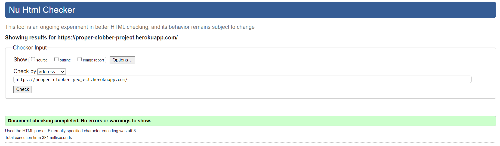

### CSS

#### W3C CSS Validation Service

* [W3C CSS Validation Service](https://jigsaw.w3.org/css-validator/) was used to validate the CSS of the project. As well as showing no errors when validating the projects CSS through its URI, there was also no errors when each CSS file was validated through direct input.

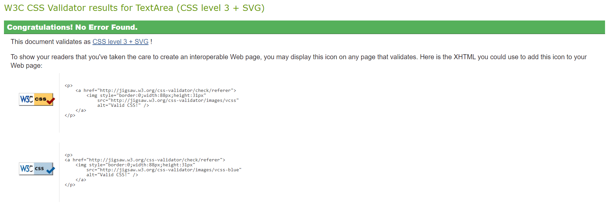

### JavaScript

#### JSHint

* All JavaScript files or snippets of JavaScript at the bottom of HTML files were validated successfully through [JSHint](https://jshint.com/).

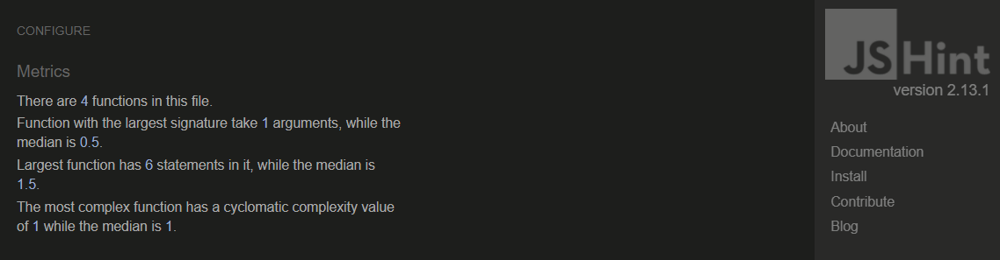

### Python

* All Python files were validated through the use of [PEP8 online](http://pep8online.com/) and all passed successfully.

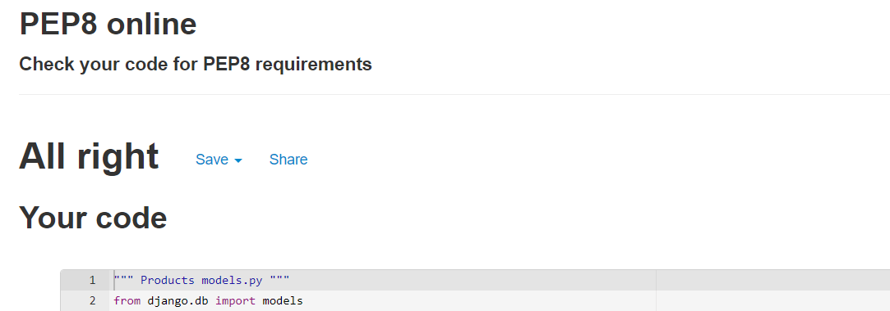

* A Gitpod built-in linter called pylint was also used to fix bugs within the python code and provided many suggestions on how to improve the code. For instance it advised to place a docstring at the top of all the python files.

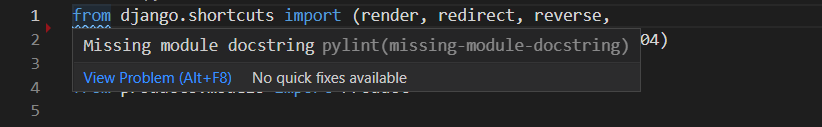

### Lighthouse

* Lighthouse was also used to test the project on both desktop and mobile.

#### Desktop

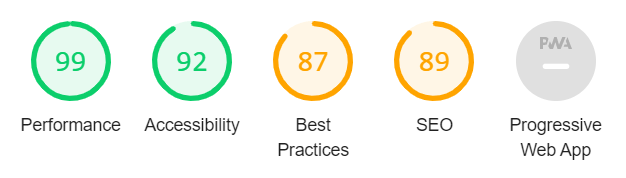

#### Mobile

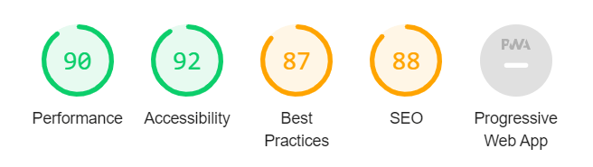

## Testing of User stories from UX section of README.md

* As an unregistered customer...

    #### General

    * *I want to be able to understand the purpose of the website.*

        * On arrival of the website, the user is able to understand the purpose of the website. This is due to the use of imagery, logo, the homepage CTA and the navigation links available to the user to visit.

        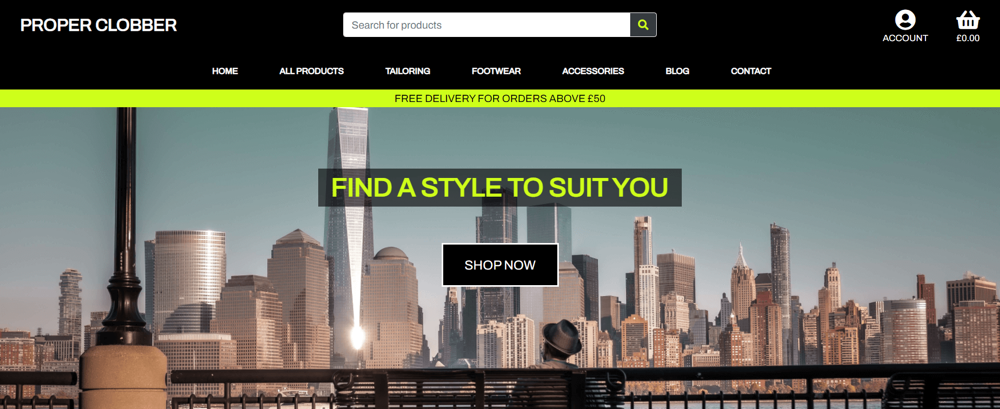

    * *I want to be able to easily navigate around the website.*

        * The user is able to navigate around the site easily by the use of the Fixed top navigation bar on every page of the website. The user can change page very quickly with close access to the navigation bar at all times. All links in the navigation bar are easily identifiable and dropdown menus are located on some links to help the user find something more specific for their needs.

    * *I want to be able to easily locate and create a new account.*

        * The user is able to create an account by selecting 'Sign up' from the 'Account' dropdown menu.

        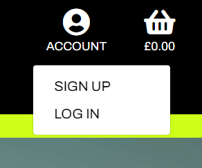

        * The user is then taken to the sign up page where the form prompts the user what to input in each input field with the help of placeholder text.

        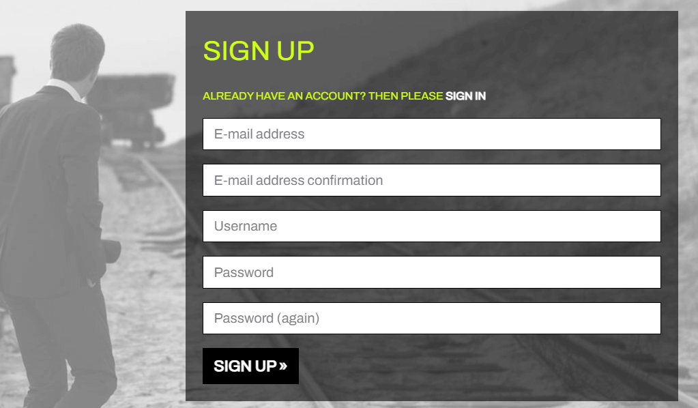

        * The user is then informed their account needs verifying. An email is then sent to the user with a link taking them to a page on the website allowing them to confirm their email. Once confirmed, they are redirected to the login page in which they can now sign in with their new account credentials.

    * *I want to be notified when making specific actions on the website.*

        * The user is presented with a toast message on the top right of the screen when a specific action is taken. When adding products the user is shown their current basket. They are also notified when registering, signing in, logging out or when a user purchases their order. Below is an example of a toast message notifying the user of a specific action:

        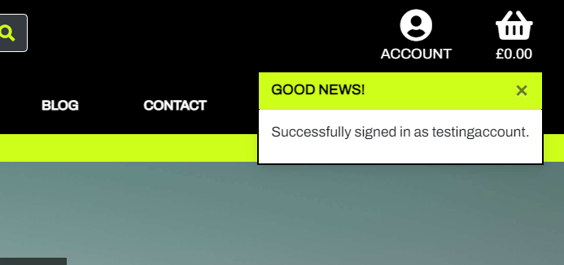

    #### Products

    * *I would like to view all the products the website is selling.*

        * The user is able to view all the products the website is selling by clicking on the home page 'Shop now' CTA button. The user can also access all the products by clicking on the navigation link 'All Products'. This is so the user can easily view all the variety of products the site has to offer.
    
    * *I want to be able to search in the header for a specific product I am looking for.*

        * The user is able to search for specific products in the search bar of the website header.

        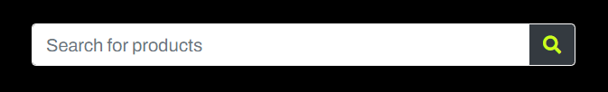

        * The user can search for a product by inputting a query into the search bar and pressing enter or clicking on the magnifying glass. Below is an example of a search query result:

        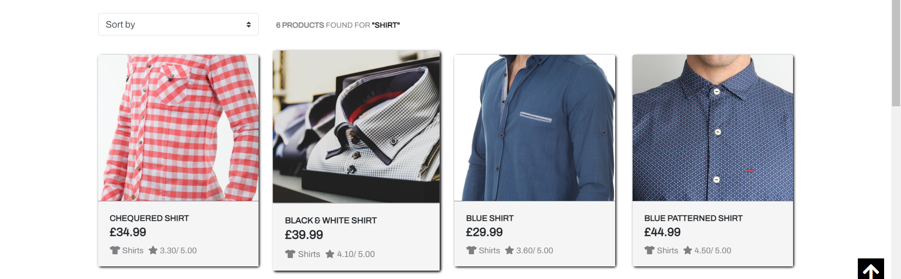

        * If the user searches for a product that doesn't exist, they are met with the following page:

        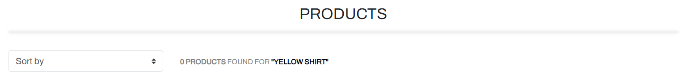

        * The user is also informed if they failed to input anything in the searchbar with a toast presenting an error message:

        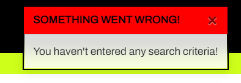

    * *I want to be able to filter the products by specific details such as price or alphabetical order.*

        * The user is able to view products by a specific order with the use of a 'Sort by' select box. It is placed at the top left of the products page and the user can view the products by their price for instance, as they may have budget limitations or might want buy something slightly more expensive.

        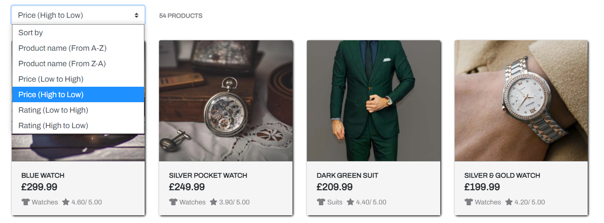

    * *I would like to be able to view separate categories of clothing for convenience.*

        * The user is able to view specific categories by using the 'Tailoring', 'Footwear' and 'Accessories' navigation bar dropdown menus:

        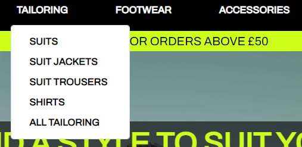

        * This way the user is able to view a category they are specifically looking for. They can also view a product by category by using the link on each product card when they are viewing 'All Products'.

    * *I would like to be able to view individual products on another page.*

        * The user can click on each individual product in order to view the products specific details.

    * *I would like to interact with that product, by changing quantity, choosing size or adding it to the basket.*

        * When the user has clicked on an individual product, they are able to change the quantity and choose a size required. When happy with their selection they can add their product to the basket by clicking on the 'Add to Basket' button.

        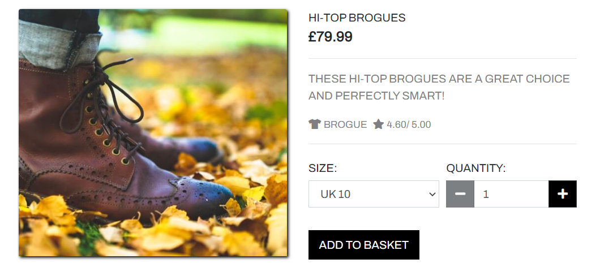

    * *I want a toast message to appear every time I add a product to see the current contents of my basket.*

        * When the user adds a product to the basket, a toast pops up showing the user what the contents of the basket are. It shows the products, the products description, size and quantity selected. The user is also able to visit the basket page by clicking on the 'Secure Checkout' button.

        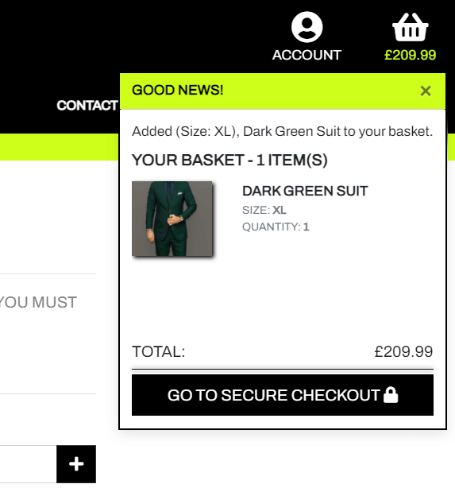

    #### Basket

    * *I want to be able to view my selected products in the basket.*

        * The user is able to view the contents of the basket by navigating to the basket page. The user can see the all the relevant information belonging to the item selected, i.e. description, size and quantity.

        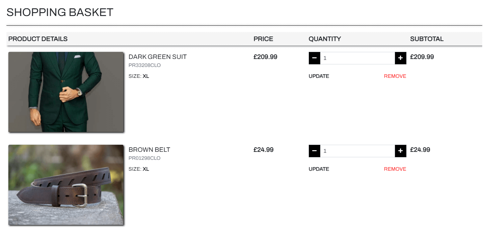

    * *I would like to update quantity amount of a certain product or remove it from the basket.*

        * The user can update the quantity of the chosen product by clicking on the plus and minus icons at either side of the select box field. Once altered to the amount the user wants, they need to click on 'Update' and it will update to the correct quantity selected. They can also remove the item altogether by selecting 'Remove'.

        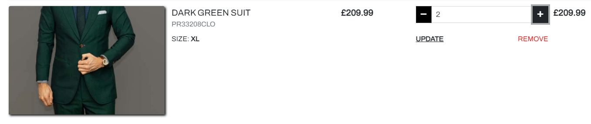

    * *I want to be able to see the total of my basket and see it regularly updated by any changes.*

        * Any alteration made by the user such as updating the quantity of product or removing it will adjust the basket total accordingly. Below shows an image of one item and the second image, shows the updated basket total when there is two products:

        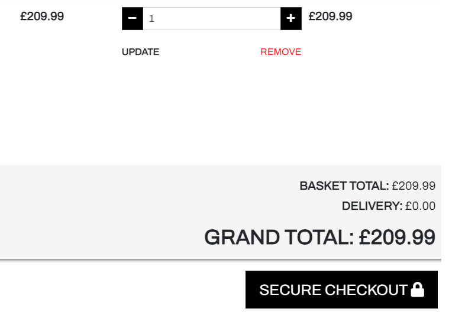
        
        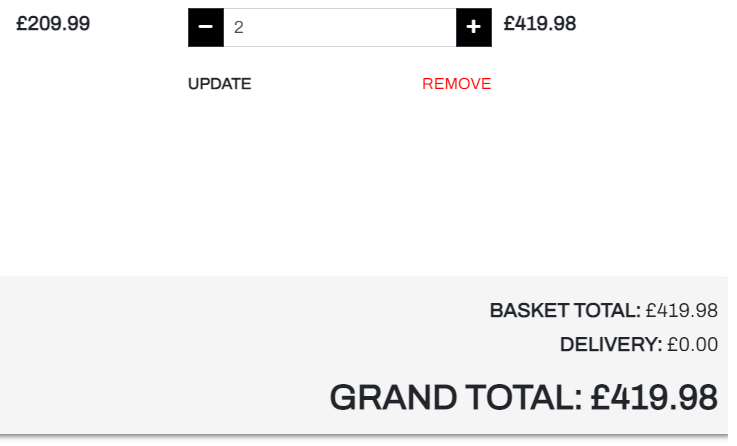
    
    #### Checkout

    * *I want to be able to securely checkout and purchase the products.*

        * Once the user is happy with their basket and click on the 'Secure Checkout' button on the Basket page, they will be taken to the checkout page. On the right of the screen, the user is able to clarify the items in the basket are what they want. The user can change any of them by clicking on the 'Adjust Basket' button below the form on the left and go back to the Basket page.

        * The user can checkout their order by filling out the form and inputting their card details. Once the form is valid, the checkout process can be completed successfully.

        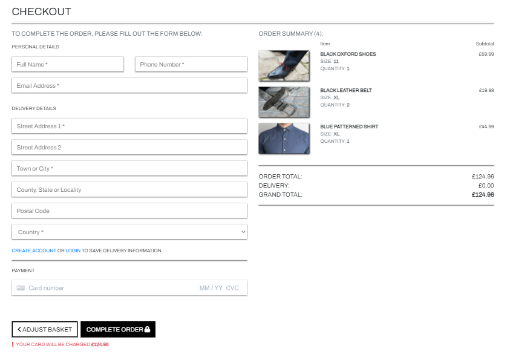

    * *I want to receive an order confirmation once the items are purchased and for it to possess all the details of the order.*

        * Once the user has successfully checked out and ordered their items, the user is taken to the checkout success page. On this page the user can see their order information from the order just made.

        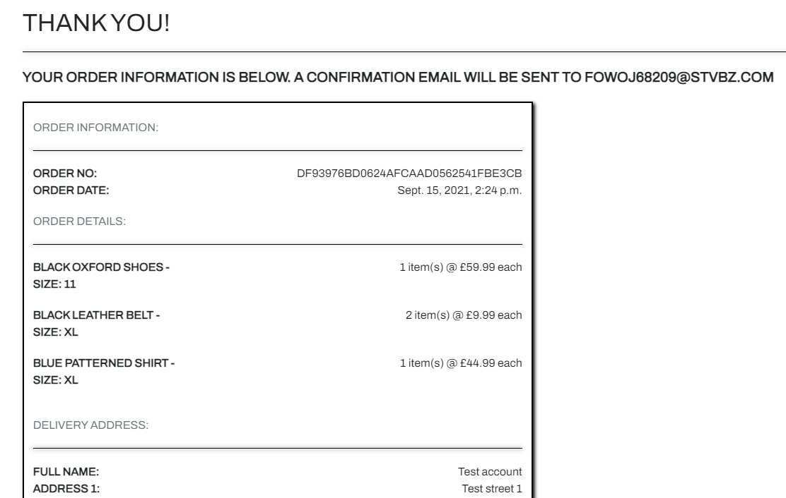

    #### Blog

    * *I want to view the website blog and see what useful insights there might be.*

        * The user can visit the blog by clicking on the 'Blog' link in the navigation bar. They can view all the blogs added on this page.

        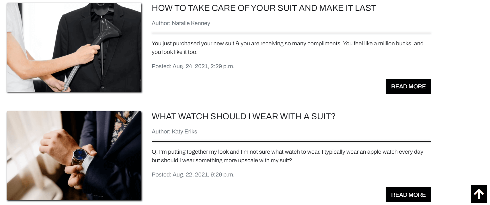

        * The user can click on the 'Read More' button to read that specific blogs full article. On a specific blog detail page, the user can see the origin of the blog by clicking on the credit link near the top of the page or on the 'Read Full Artcile Here' button at the bottom of the page.

        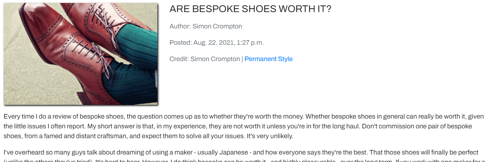

    #### Contact

    * *I would like to be able to contact the store owners with any query I have.*

        * The user can access the contact page by clicking on the 'Contact' page link on the navigation bar. The user is able to provide their name, email, subject and message before submitting it to the site owner.

        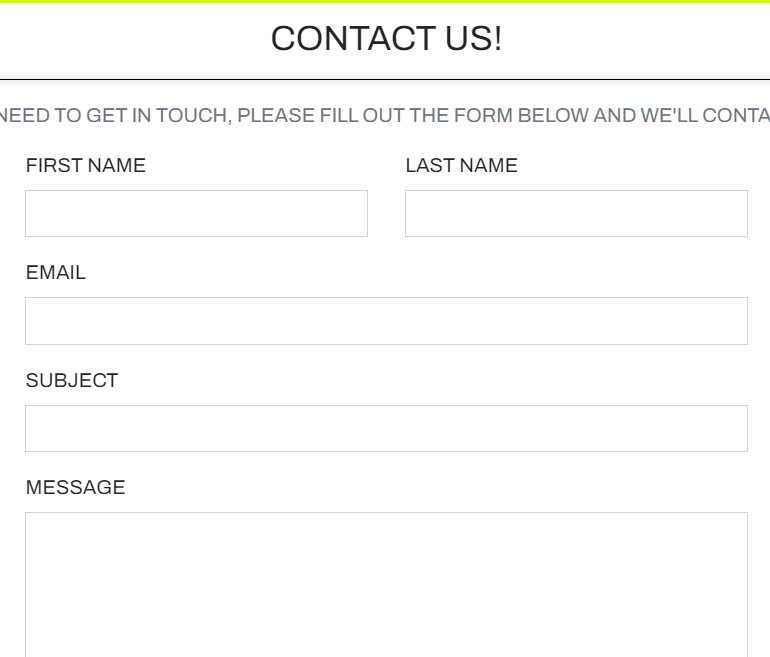 

    * *I want to receive a confirmation email notifying me they know of my query.*

        * Once the form is valid and the user clicks on the 'Send Message' button, the user receives an email advising them the site owner will be in touch shortly.

        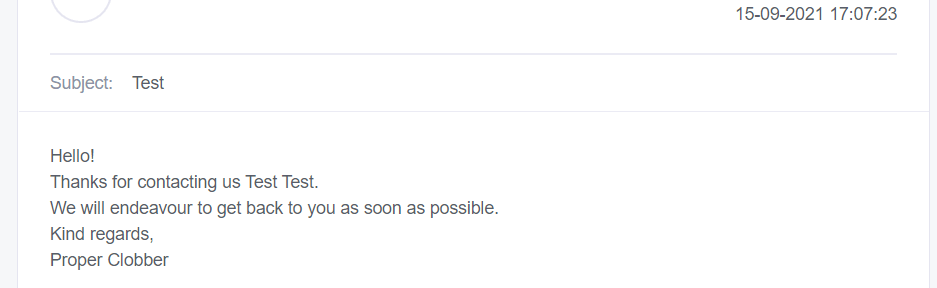

        * A toast also appears advising the user the site owner will be touch shortly.

        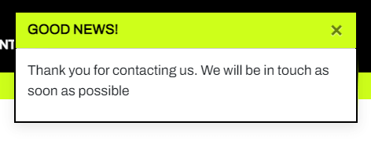

* As a registered customer:

    * *I want to be able to login and out of the website comfortably.*

        * The user is able to successfully login to the website by going to to the 'Account' dropdown menu on the top right of the navigation bar. The login page requires an email or username and a password to access their account and the details can be remembered by an optional checkbox, making it quicker for the user logging into the website in the future.

        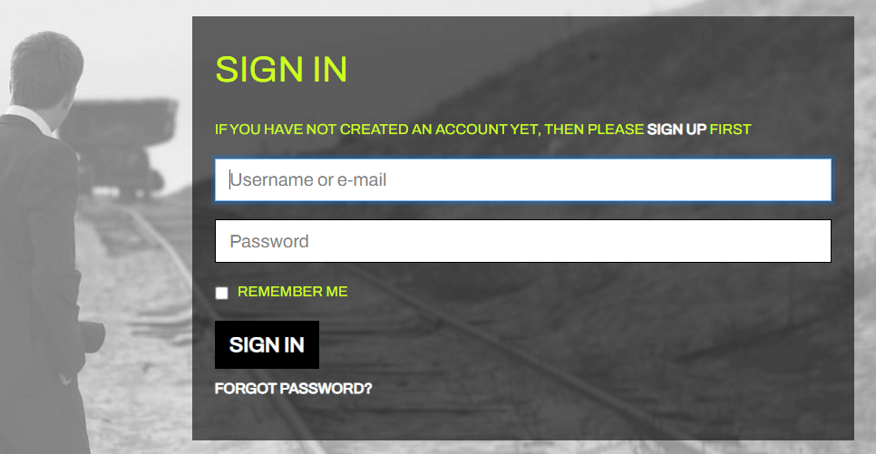

        * The user can also log out by going to the 'Account' dropdown menu when signed in and selecting 'Log Out'. The user is then taken to the log out confirmation page allowing them to change their mind if necessary.

        

    * *I want to be able to reset my password.*

        * The user is able to reset their password by clicking on the 'Forgot Password?' link on the login page. When they click on it, they are taken to a page instructing them to input their email so an email can be sent with a link for the user to reset their password. When the user clicks on the link, they are then able to change their password and confirm it by inputting it a second time. Once the user has finished, they are advised it has been successfully reset and a toast message advises them too.

    * *I want to be able to view my personal profile.*

        * When the user is signed in, they can access their profile by going to the 'Account' dropdown menu and clicking on 'My Profile'. This page shows default delivery details and previous order history information belonging to the specific logged in profile.

    * *I want to be able to save default delivery details to skip the process of adding them in on a second order.*

        * The user can do this on the Checkout page when purchasing their order. Below the order form, is an optional checkbox for the user to interact with. If it is clicked when the order is submitted, the delivery information is saved to the profile page.

        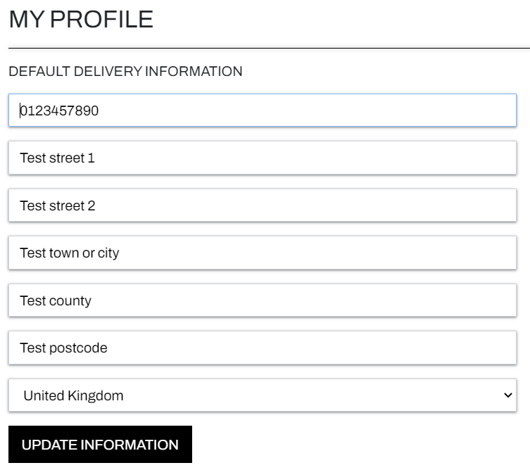

    * *I want to be able to update my default delivery details.*

        * The user can do this by visiting their profile page and filling out the form and when finished they can save it by clicking on 'Update Information'. When they return to the Checkout page, they will then see the updated delivery address details.

    * *I want to be able to view previous orders in the order history.*

        * The order history can be viewed on the right hand side of the profile page. It shows a list of all orders made and the user can view the full details of an order by clicking on the order number link.

        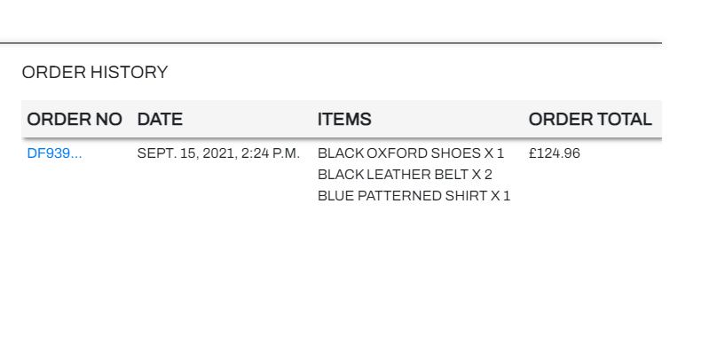

* As the store owner:

    * *I want customers to be able to select and purchase products comfortably.*

        * Customers are able to easily view products, choose a size and quantity and add it to their basket before checking out securely. They are then provided with a order confirmation reciept on the checkout success page as well as an email confirming their order.

    * *I want customers to enjoy reading the blogs and insights the website has to offer.*

        * Users are able to visit the blog easily on the main navigation bar. They can view all the previews on the blog page, visit each page to view the full article and they can visit the origin of the blog too. The blogs have potential useful information relevant to the user with regards to clothing.

    * *I want the user to be able to contact us with any queries or problems.*

        * The user can easily contact the site owner through the Contact page. They are notified of their message has been successfully sent through the use of a toast and a confirmation email.

    * *I want to be able to add/edit/update products.*

        * As the site owner, products are able to be added by going to the Product Management page which is located in the 'Accounts' dropdown menu.

        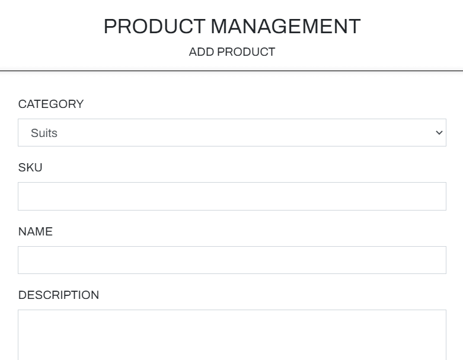

        * Products can be edited and updated by clicking on the 'Edit' button on the Product page or Product Detail page. This takes the site owner to the Product Management (Edit Product) page where the input fields are prepopulated with existing product information so it can be easily edited and updated.

        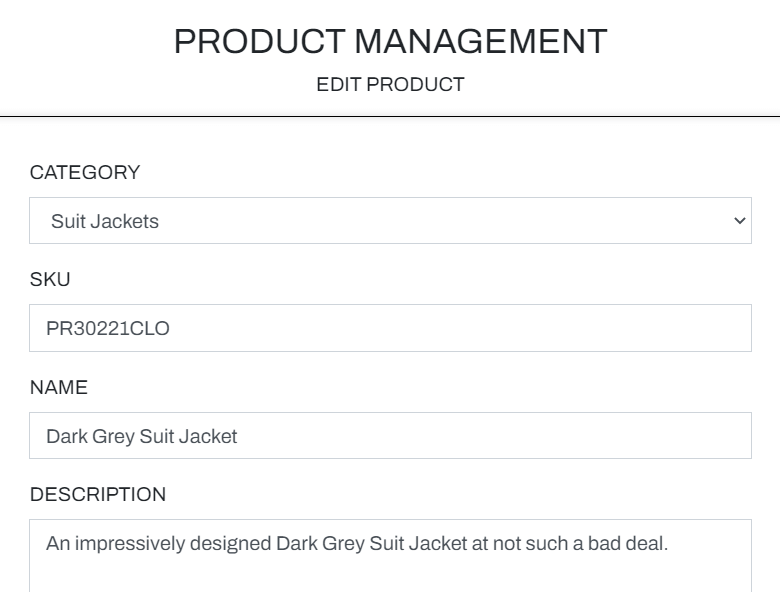

    * *I want to be able to delete products.*

        * Products can be deleted by the site owner when they are on the Product or Product Detail page. If they click on the 'Delete' button, a modal appears giving the user the option to confirm the deletion to better prevent accidental deletion of a product.

        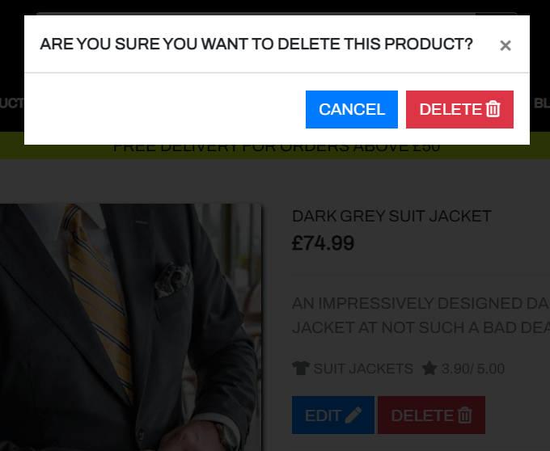

    * *I want to be able to add/edit/update blog posts.*

        * As the site owner, blog posts are able to be added by going to the Blog Management page which is located in the 'Accounts' dropdown menu. 

        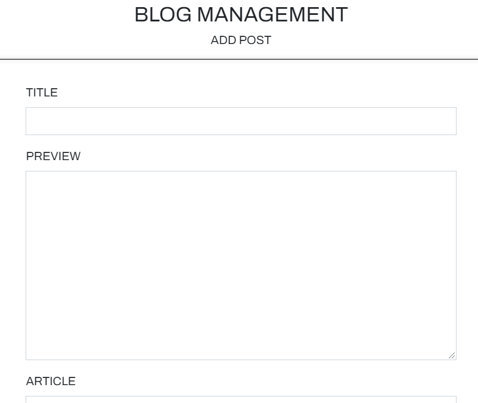

        * Blog posts can be edited and updated by clicking on the 'Edit' button on the Blog page or Blog Detail page. This takes the site owner to the Blog Management (Edit Post) page where the input fields are prepopulated with existing blog post information so it can be easily edited and updated.

        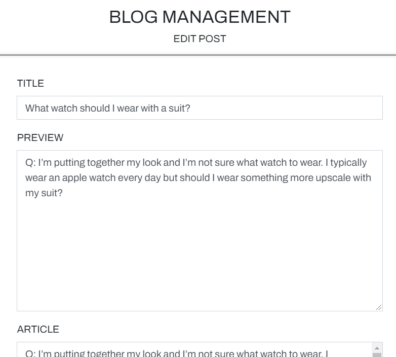

    * *I want to be able to delete blog posts.*

        * Blog posts can be deleted by the site owner when they are on the Blog or Blog Detail page. If they click on the 'Delete' button, a modal appears giving the user the option to confirm the deletion to better prevent accidental deletion of a blog post.

        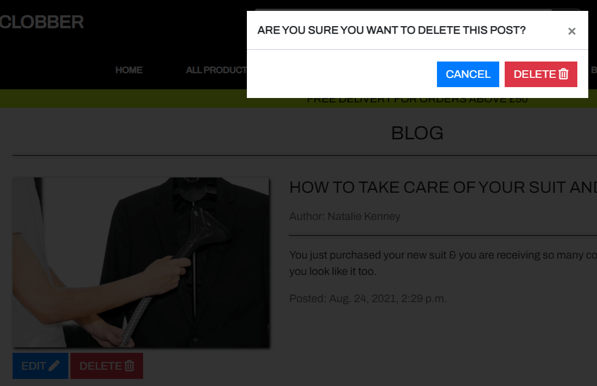

    * *I want to be able to maintain the use of the website information with the use of the admin panel.*

        * As a site owner, the admin panel is very useful in managing things like products, blog posts, users,messages from users and orders.

## Testing process

### Manual Testing 

The website was thoroughly tested and a detailed account of the manual testing is below:

#### Navigation bar

* All navigation bar links were tested and worked correctly. &check;
* All dropdown menus appear correctly when their link has been clicked and all dropdown menu links take the user to the right page. i.e dropdown menus for categories take the user to the specific one selected. &check;
* The 'Proper Clobber' logo takes the user back to the home page as intended. &check;
* Below the basket icon, shows the total price of the current basket and correctly changes price every time an item is added or removed. &check;
* The search bar works as expected, it returns a page of products if the user correctly matches something in the product database. &check;
* If a search query doesn't match a product on the site, the user is informed that '0 Products found for "*Query*". &check;
* If nothing is inputted, the user receives a toast advising they haven't 'entered any search criteria!'. &check;

> The link to the Profile page on mobile was missed until it was fixed in the testing process. &check;

#### Footer

* All social media links take the user to the correct page and correctly open a new tab for the user to view them on. &check;

#### Home

* The 'Shop Now' CTA button takes the user to the 'All Products' page as intended. &check;

#### Sign up page

* The user can sign up and create an account by visiting the 'Accounts' dropdown menu. When they click on 'Sign Up' they are taken to the correct page to register. &check;
* Each form field provides a message if they have not been filled in correctly. &check;
* A notification will appear if a user has already registered with the email address they are using. &check;
* A message saying username exists will appear if the user inputs one already taken. &check;
* A 'password is too short' message appears if the user doesn't fill it in correctly. &check;
* Password 'too common will also appear. &check;
* It will show Password is 'entirely numeric. &check;
* Email is successfully sent to user when taken to verification page. &check;
* The link in the email takes the user to a page in which they can confirm verification. &check;
* Once signed up successfully, the user is redirected to login page so they can sign in with new credentials. &check;
* The link that takes the user to the login page works as intended. &check;
* All Allauth buttons works as expected. &check;

#### Login page

* A message will appear advising the user that the 'Username and/or Password specified are not correct'. &check;
* The user can sign in with a username or email. &check;
* The link that takes the user to the sign up page works as intended. &check;
* The user can reset their password by clicking on 'Forgot Password?'. It takes them to a page where they input their email address. When the user clicks on the link, they are able to change password and are advised its been successfully reset. &check;
* The form fields alert the user if they haven't input anything into each field. &check;
* All Allauth buttons works as expected. &check;

#### Logging out

* When the user is logged in they can log out by going to the 'Accounts' dropdown menu and selecting 'Log Out'. It correctly takes them to the Log out page where the user can log out. &check;
* When the user confirms they are logging out, by clicking on the 'Sign Out' button it correctly signs them out of their account. &check;

#### Products

##### Product page

* Each product takes the user to that specific products detail page. &check;
* Each product zooms in slightly when hovered over correctly &check;
* The sort by select box options were all tested and ordered all the products correctly. &check;
* The number of products on the page presented next to the sort by select box always shows the correct amount of products currently on the page. &check;

##### Product Detail page

* When the user hovers over the product image, it zooms in slightly as expected. &check;
* When the user clicks on the product image, it opens a new tab for the user to view a full page image of the product as intended. &check;
* The size select box shows the correct sizes for the product and works as intended. &check;
* If an item has clothing sizing it will shows sizes; XS to XXL as intended and for footwear sizing; UK 6 to UK 13 as intended. &check;
* The quantity select box minus and plus buttons work correctly. i.e they decrease or increase quantity by 1 each time they are pressed. &check;
* The quantity will not go below 1 as intended and above 10 as intended. If the user tries to manually input a number out of this range, they aren't able to add the product to basket and will be informed it must be 'less than or equal to 10'. &check;
* The 'Add to Basket' button works as expected and adds the item(s) to basket. &check;

#### Basket

* When no items have been added to the basket, the Basket page shows a 'Continue Shopping' button which correctly takes the user to the 'All Products' page. &check;
* The Basket page correctly shows all the items and the item specifics selected by the user and matches the basket toast shown every time a user adds something to the basket. &check;
* The user is able to change quantity of an item by clicking the minus and plus buttons. &check;
* The user cannot go below 1 or above 10 when selecting a quantity. &check;
* The update and remove links were as expected. When a quantity has been increased or decreased and the update link is clicked, the user is met with the new updated quantity and the price changes correctly too. &check;
* When the user clicks on the remove link, the item is removed successfully and the total basket price changes accordingly too. &check;
* Both Basket page and the Basket toast shows the free delivery message advising the user if they spend a certain amount, they'll receive free delivery. If the total price is above £50, the message doesn't appear correctly. &check;
* The 'Secure Checkout' button correctly takes the user to the Checkout page. &check;
* The 'Secure Checkout' button on the Basket toast correctly takes the user to the Basket page as intended. &check;
* The subtotal and grand total prices correctly change with compliance to any changes made to items. &check;

#### Checkout

* The checkout page shows the correct items in the basket. &check;
* If the user has added any delivery details to their profile and saved them, they are automatically filled in on the Checkout page. &check;
* The checkbox allowing the user to save their delivery information when they order their items works as intended. It doesn't save the information if left blank but does stay their the next time the user goes to their Profile page or goes to the Checkout page again. &check;
* If the user isn't logged in, two links to create or login to an account to save delivery information is shown and both links take the user to the right page. &check;
* All form fields with asterisks need to be filled in and the user is met with a message for each one if its not filled in or valid. &check;
* The country form field correctly shows all the countries the user can input and works when one is selected. &check;
* The 'Adjust Basket' button takes the user back to the Basket page as intended. &check;
* The card payment field shows a specific message if a card number is not entered correctly or the expiry date, security code or ZIP code is entered correctly either. &check;
* When every form field is valid and the user presses on the button 'Create Order', they are met with a loading screen and then taken to the Checkout Success page. &check;
* The Checkout Success page shows the order details to the user and they are saved in the order history of the users Profile page if a user ordered it signed in. &check;
* The user is also sent an email confirming their order and is given all the appropriate order information in the email too. &check;

#### Profile

* The Default delivery information can be edited and saved by pressing on the 'Update Information' button which saves it as intended and a toast appears saying the Profile is updated successfully. &check;
* The users order history also shows a list of all past orders and each order has a link to its order information on the order number which works correctly. &check;

#### Blog Management

* The user is correctly taken to the page where they can add a blog post when selecting 'Blog Management' on the 'Accounts dropdown menu. &check;
* All form fields work as expected, the form fields which need something inputting in will inform the user if nothing has been added to them and stop them submitting. &check;
* The image field works successfully and adds a blog post image. If no image is given, the default one shows instead. &check;
* Edit buttons on both the Blog page and Blog Detail page take the user to the correct Edit post page. &check;
* The Delete buttons both work on the Blog page and Blog Detail page, opening up a modal successfully. &check;
* The cancel button works correctly on the modal and so does the cross, cancelling the deletion. &check;
* The Delete button on the modal works successfully removing the blog post from the site and showing a toast, saying its been deleted successfully.
* The use of `linebreaks` works on the blog article when a new post is created. &check;
* The 'Create Post' button works when all the form is valid on the add blog post page. &check;
* The 'Edit Post' button works when all the form is valid on the edit blog post page. &check;

#### Product Management

* The user is correctly taken to the page where they can add a product when selecting 'Product Management' on the 'Accounts dropdown menu. &check;
* All form fields work as expected, the form fields which need something inputting in will inform the user if nothing has been added to them and stop them submitting. &check;
* The image field works successfully and adds a product image. If no image is given, the default one shows instead. &check;
* Edit buttons on both the Product page and Product Detail page take the user to the correct Edit product page. &check;
* The Delete buttons both work on the Product page and Product Detail page, opening up a modal successfully. &check;
* The cancel button works correctly on the modal and so does the cross, cancelling the deletion. &check;
* The Delete button on the modal works successfully removing the product from the site and showing a toast, saying its been deleted successfully.
* The 'Create Product' button works when all the form is valid on the add product page. &check;
* The 'Edit Product' button works when all the form is valid on the edit product page. &check;

#### Blog

##### Blog page

* The blog page shows a list of blogs added and can view a full specific blog post succesfully by clicking on the 'Read More' button.

##### Blog Detail page

* The blog detail page has two links to the origin of its specific blog post by clicking on either the credit link at the top of the page or the 'Read Full Article Here' button and both work correctly. &check;
* Clicking either of the links above will open the blog origin on a new tab as intended &check;
* The 'linebreaks' used on the `{{ post.article|linebreaks }}` works correctly. It separates the blog post article into paragraphs if the superuser has paragraphed in the add/edit blog page article input field. &check;

#### Contact

* All form fields show a message if nothing is inputted into them or its content is not valid and stops the user submitting the form until it is valid. &check;
* When the form is submitted, the user receives a confirmation email advising them the 'Proper Clobber' have received the query and will be touch shortly. &check;
* A toast also appears on successful submission telling the user, 'Proper Clobber' will be in touch shortly.

#### Toasts

* The toasts appear correctly any time a relevant action has been taken. &check;
* The JavaScript used for the toast messages work as intended. The toast appears for 6 seconds and fades out for 2 seconds. &check;
* All information and links work as expected on the Basket toast. &check;

#### CRUD Functionality

* All CRUD functionality was tested and worked as expected. &check;

#### Responsiveness

* The websites responsiveness was established with the help of the framework [Bootstrap](https://getbootstrap.com/docs/4.4/getting-started/introduction/). The project was tested on numerous devices and on Google Chrome Dev Tools and resulted in no issues with regards to responsiveness.

#### Browsers and devices

The website was visited and interacted with by family members and friends who provided feedback and provided their technology for me test the project on.

* The website was tested on the following:

    * ASUS ZENBOOK UX434
    * iPhone 12
    * iPhone X
    * iPad
    * Huawei P Smart

* The website was tested on the following browsers:

    * Safari
    * Firefox
    * Google Chrome
    * Microsoft Edge

#### Stripe Testing

* The Stripe functionality has been tested and the result below shows the webhooks generated from a successful order.

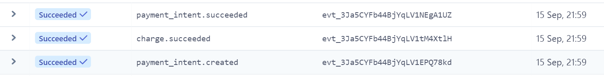

#### Defensive Programming

#### Fixed Bugs

##### Bug 1

* During the testing process, I realised that on mobile devices when the superuser was logged in, that the dropdown menu didn't fit the screen correctly due to the navigation links being very long.

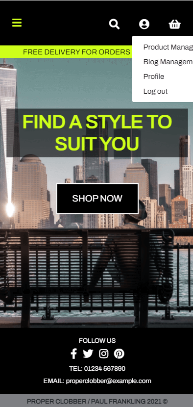

* I visited [Bootstrap](https://getbootstrap.com/docs/4.4/getting-started/introduction/) and added `dropleft` to the dropdown menu class and although I think it might look better below the icon, it at least shows the navgation links fully.

##### Bug 2

* During the testing process, all the modals were tested throughout the website and out of four of them, three worked as expected. The one with the bug was on the Product page. When the 'Delete' button is clicked on by the superuser, the modal will appear so the superuser can confirm deletion. When the modal was activated, the screen would furiously flicker and modal buttons wouldn't be able to be interacted with easily. The issue was solved by moving the modal code and pasting it below a couple of closing `
` tags.

##### Bug 3

* Again the Product page modal provided another bug. This time when a product was deleted, it would delete a different product to the one selected. I added `_{{product.id}}` to the delete buttons `data-target="#myModal"` tag and the modals `id="myModal` tag. I created a couple of products and tested the modal and both the correct products were deleted.

##### Bug 4

* When adding a product, I noticed that when the superuser inputted a valid image URL into the relevant input field and nothing in the image file, the default 'no_image.png' would appear. I added an `elif` statement to each occurence of product imagery in the project so that if nothing was entered in the image file field, the URL would render correctly.

#### Known Bugs

* If the superuser adds a product and selects 'Yes' to both clothing size and footwear size, it will show both size boxes on the product detail page as shown below:

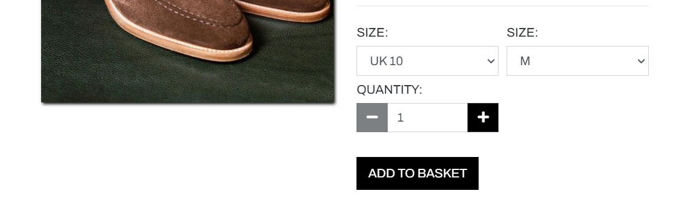

* The superuser though should never find themselves in a position where both sizing select fields need to be used for an individal product. It would be highly unlikely a product needs to yield both size fields.